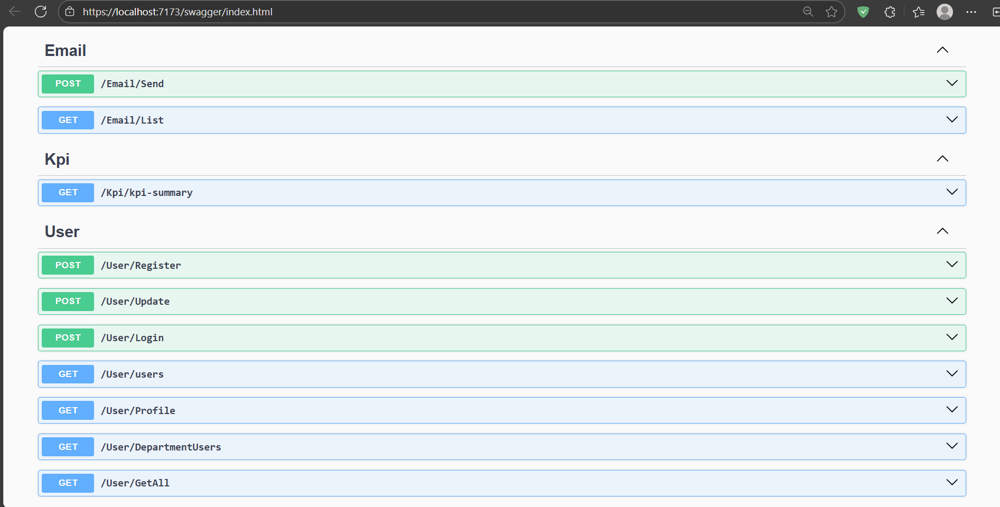

# My Email Web API
Even though the project name is <b>My Email Web Api</b>, it also includes <b>Case 2: Setup Akses Read Berdasarkan User Role (Berbasis API)</b> and <b>Case 3: Generate KPI Summary dan Visualisasi Data (Berbasis API)</b>

## Table of Contents
- [Setup](#setup)
- [Swagger](#swagger)
- [Case 1](#case-1-setup-email-notification-dan-implementasi-template-email-berbasis-api)
- [Case 2](#case-2-setup-akses-read-berdasarkan-user-role-berbasis-api)
- [Case 3](#case-3-generate-kpi-summary-dan-visualisasi-data-berbasis-api)

## Setup
1. Update appsettings.json sections ConnectionStrings and Smtp to suit your environment.
2. This project uses SQL server. If you use any other DB, you'll need to install its driver NuGet package and onboard it to `Program.cs`. Else if you use SQL server, you can skip this step.
3. Migrate contexts
    - cd to project folder if you haven't (MyEmailWebApi.csproj should be in working directory). `cd MyEmailWebApi`
    - Migrate each of DbContexts
    ```
    dotnet ef database update --context MyEmailWebApi.Data.EmailContext
    dotnet ef database update --context MyEmailWebApi.Data.UserContext
    dotnet ef database update --context MyEmailWebApi.Data.KpiContext
    ```
## Swagger
To ease development and testing, swagger is in this project. If you run https debug profiler, you can access swagger index at https://localhost:7173/swagger/index.html. Else if you use another debug profiler, you can infer the port from `Properties/launchSettings.json` or from container.



## Case 1: Setup Email Notification dan Implementasi Template Email (Berbasis API) 
1. I have created /Email/Send endpoint which receives recipient (required), subject, and body fields from POST body.
    - Body is sanitized from potentially harmful tags and attributes.
    - For example, script tag and onload attribute will be stripped to prevent XSS attack.
2. I have used an SMTP client to send email with configurables in `appsettings.json` section `Smtp`
3. I have coded /Email/Send endpoint to save email history to SQL server, including recipient email, subject, body, and sent at fields.
4. I have created /Email/List endpoint to serve email history.

## Case 2: Setup Akses Read Berdasarkan User Role (Berbasis API)
Roles are automatically seeded in Program.cs for simplicity.
1. I used [IdentityUser](https://learn.microsoft.com/en-us/dotnet/api/microsoft.aspnetcore.identity.identityuser?view=aspnetcore-8.0) by Microsoft for user model.
    - Register using /User/Register endpoint.
    - Grant user roles and departments using /User/Update endpoint.
        - Email field is for identifying which user to update.
        - Ideally this endpoint would be protected, but as the case didn't specify it, I let it be for simplicity.
2. I have implemented /User/users endpoint which serves user list according to logged in user role.
    - Specifically, it checks user role and redirects to a suitable endpoint (clients can handle this automatically).
3. Role-Based Access Control (RBAC):
    - By design, [IdentityUserRole](https://learn.microsoft.com/en-us/dotnet/api/microsoft.aspnetcore.identity.identityuserrole-1?view=aspnetcore-8.0) can hold several roles for the user. I followed this paradigm and authorize the logged in user by their highest role held.
    - Admin role will be redirected to /User/GetAll which is only accessible by admins and serves all users list.
    - Manager role will be redirected to /User/DepartmentUsers which is only accessible by admins and managers. It serves a list of users with the same department(s) as logged in user.
    - Employee role will be redirected to /User/Profile which is accessible for all employees. It serves the logged in user data.
    - With this design, admins and managers can access endpoints of finer granularity too instead of only one. While employees and managers will still be prevented from accessing endpoints not within their authority.
4. [Authorize](https://learn.microsoft.com/en-us/dotnet/api/microsoft.aspnetcore.authorization.authorizeattribute?view=aspnetcore-8.0) filter is used to manage access by role.
5. I used SQL server to save and query user data.

## Case 3: Generate KPI Summary dan Visualisasi Data (Berbasis API)
Companies and KPIs are automatically seeded in `Program.cs` for simplicity.
1. I have created /Kpi/kpi-summary to produce KPI summmary of all companies.
2. I have created Companies table to save companies info and MarketingKpis table to save companies' KPI values.
3. /Kpi/kpi-summary calculates average KPI score for each company.
4. Aside from KPI average, I also included elements data in hope that I could serve it in a simple frontend later. JSON output example:
```
[
  {
    "companyName": "Indomaret",
    "impressionsAverage": 223790008.91666666,
    "clicksAverage": 29442.916666666668,
    "leadsAverage": 590.8333333333334,
    "ordersAverage": 158.83333333333334,
    "monthlyMarketingKpi": [
      {
        "date": "2024-11-01",
        "impressions": 220688,
        "clicks": 1640,
        "leads": 48,
        "orders": 3
      },
      ...
    ]
  },
  {
    "companyName": "Geek Garden",
    "impressionsAverage": 170789963.58333334,
    "clicksAverage": 28291.75,
    "leadsAverage": 605.6666666666666,
    "ordersAverage": 187.16666666666666,
    "monthlyMarketingKpi": [
      {
        "date": "2024-11-01",
        "impressions": 148263,
        "clicks": 1210,
        "leads": 13,
        "orders": 1
      },
      ...
    ]
  }
]
```
5. Unfortunately, I don't have enough time left within the assignment to develop data visualization. I can handle front-end development and maintenance though. Here is my latest front end personal project: [My Form](https://github.com/MEvanAW/my-form/tree/master).